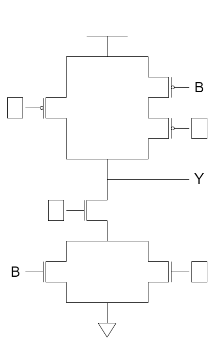
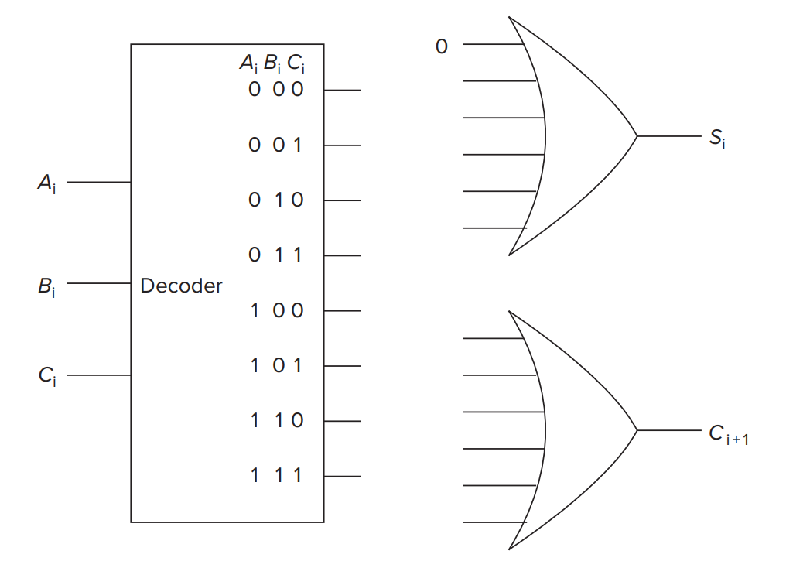
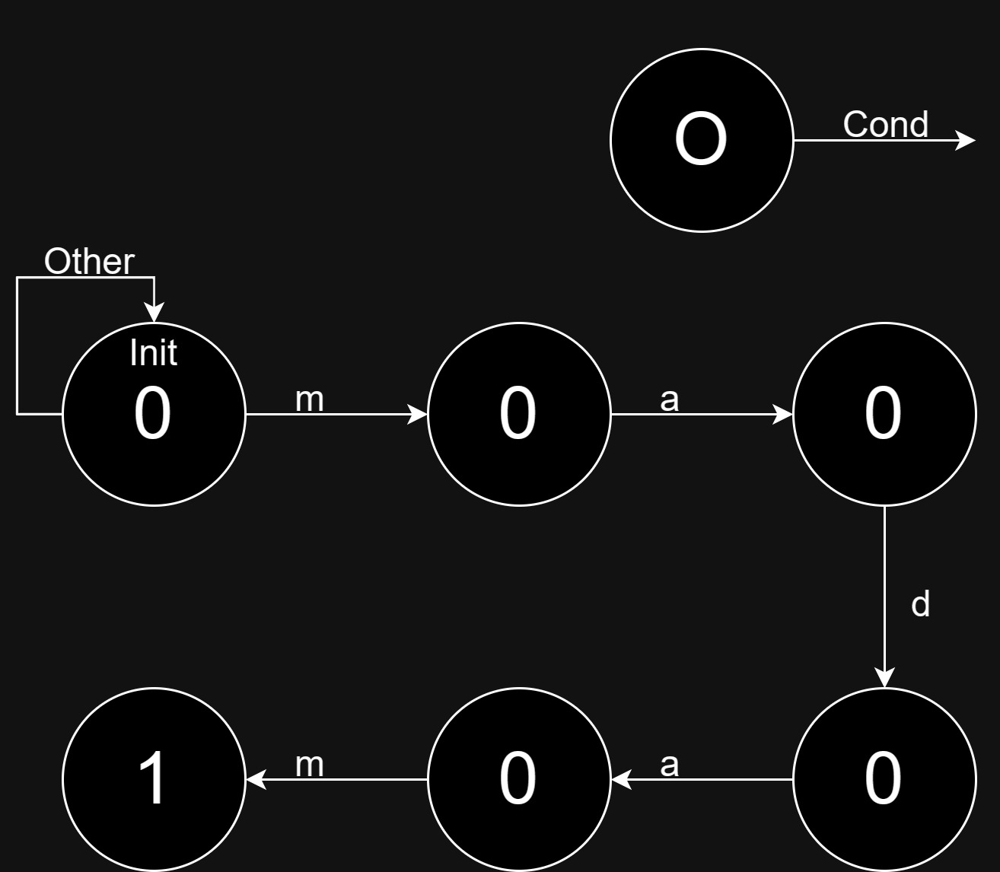

# 作业二

## 作业说明

- 作业可以使用中文或英文完成，**请勿抄袭**
- BB 系统上请提交 **电子版 PDF**，允许 LaTeX、Markdown、Word、手写拍照等
- Deadline: 10 月 20 日 23:30，**逾期 0 分**
- 本次作业 [PDF](/pdf/hw2.pdf)
- [答案](/pdf/ans2.pdf) 已发布

## T1

Transistor circuit shown below produces the accompanying truth table. The inputs to some of the gates of the transistors are not specified. Also, the outputs for some of the input combinations of the truth table are not specified. Complete both specifications. i.e., all transistors will have their gates properly labeled with either A, B, or C, and all rows of the truth table will have a 0 or 1 specified as the output.

|   A   |   B   |   C   |   Y   |
| :---: | :---: | :---: | :---: |
|   0   |   0   |   0   |       |
|   0   |   0   |   1   |   1   |
|   0   |   1   |   0   |       |
|   0   |   1   |   1   |       |
|   1   |   0   |   0   |       |
|   1   |   0   |   1   |       |
|   1   |   1   |   0   |   1   |
|   1   |   1   |   1   |       |

## T2

Prove that NAND is logically complete.

## T3

Recall that the adder was built with individual **“slices”** that produced a sum bit and a carry-out bit based on the two operand bits A and B and the carry-in bit. We called such an element a full adder. Suppose we have a 3-to-8 decoder and two 6-input OR gates, as shown below. Can we connect them so that we have a full adder? If so, please do.

(Hint: If an input to an OR gate is not needed, we can simply put an input 0 on it and it will have no effect on anything. For example, see the following figure.)

## T4

Having designed a binary adder, you are now ready to design a 2-bit by 2-bit unsigned binary multiplier. The multiplier takes two 2-bit inputs A[1:0] and B[1:0] and produces an output Y, which is the product of A[1:0] and B[1:0].

1. What is the maximum value that can be represented in two bits for A(A[1:0])?
2. What is the maximum value that can be represented in two bits for B(B[1:0])?
3. What is the maximum possible value of Y?
4. What is the number of required bits to represent the maximum value of Y?
5. Write a truth table for the multiplier described above. You will have a four-input truth table with the inputs being A[1], A[0], B[1], and B[0].
6. Implement the third bit of output, Y[2] from the truth table using only AND, OR, and NOT gates. (You can just write the equation for Y[2] in terms of A[1], A[0], B[1], and B[0].)

## T5

Design a **XOR** gate with NAND gates.

|  $a$  |  $b$  | $a\text{ XOR }b$ |
| :---: | :---: | :--------------: |
|   0   |   0   |        0         |
|   0   |   1   |        1         |
|   1   |   0   |        1         |
|   1   |   1   |        0         |

## T6

The dormitory where Zhang San resides has a rule: the power is cut off at 11 p.m. on weekdays and restored at 6 a.m., while during holidays, the power is cut off at 12 a.m. and restored at 6:30 a.m. Due to concerns about sudden damage to his personal server, which he assembled using second-hand hardware, Zhang San has sought your help to design a device that can automatically control the server's power supply. Your task is to design a logic circuit that will automatically shut down the server when the output Z is 1. The circuit will receive four input variables (A, B, C, D) that answer four different yes/no questions. (1=yes, 0=no)

| variable |        question         |
| :------: | :---------------------: |
|    A     |    Is it 10:50 p.m.?    |
|    B     |    Is it 11:50 p.m.?    |
|    C     |    Is today hoilday?    |
|    D     | Is Server already down? |

Zhang San wants this device send poweroff command to server only when server is on. This device send poweroff command to server if it's the workday and it's 10:50 p.m. This device should send poweroff command to server if it's the hoilday and it's 11:50 p.m. Write the truth table and draw a gate-level diagram that performs this logic.

## T7

Here's an incomplete FSM that, when pattern `madam` occurs, produces an output `1`.

For example, given string `madamadam`, it'll produce `000010001`.

Your job is to:

1. **Complete** the state diagram.
2. Tell the **minimum number of latches** that are needed in order to implement this FSM.

> Hint: Why do we need latches in sequential logic?

## T8

There is a memory that needs $a$ bit to represent its address, and its addressability is $b$ bit.

1. How much is the memory's **address space** at most?
2. How many bits can the memory store at most?

## T9

The figure below is the diagram of the $2^2$-by-$3$-bit memory on page 78 of the textbook,.

1. To write data into the first memory location, what must the values of `A[1:0]` and `WE` be?

2. To increase the addressability of the memory to `k bit` (k > 3), please describe in text what you should change.

3. Suppose the width (in bits) of the program counter is the minimum number of bits needed to address 257 locations. How many address line should be added into the memory in the figure if we want to make full use of this PC's address space? What would the addressability of the memory be after this change was made?

## T10

In a land occupation competition participated by 2 teams, with 4 players in each team, we need to keep track of the following information on the scoreboard.

|       state        |                      possible value                      |
| :----------------: | :------------------------------------------------------: |
|  occupation ratio  |                     0~99 for 2 teams                     |
|       score        |                     0~3 for 2 teams                      |
|   time remaining   | any time from 0:00 to 3:00, where m:s (minutes, seconds) |
| skill charge ratio |                   0~100 for 8 players                    |

1. What is the minimum number of bits that we need to use to store the state required?
2. Suppose we make four separate logic circuits for each line of the four elements on the scoreboard, how many bits would it then take to store the state of the scoreboard?
3. Which one might be the better method to sepcify the state, why?
