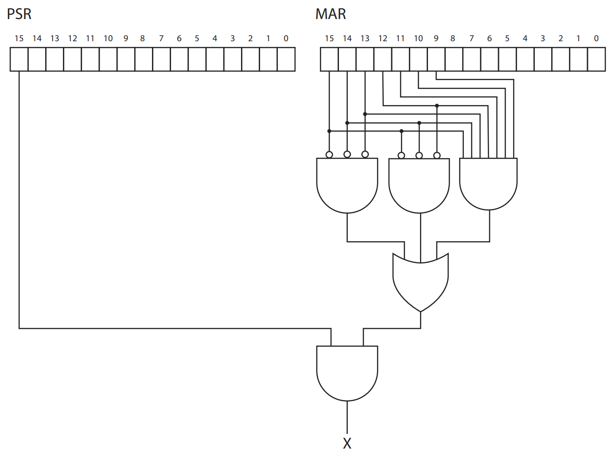

# 作业六

## 作业说明

- 作业可以使用中文或英文完成，**请勿抄袭**
- BB 系统上请提交 **电子版 PDF**，允许 LaTeX、Markdown、Word、手写拍照等
- Deadline: 12 月 24 日 23:30，**逾期 0 分**
- 本次作业 [PDF](/pdf/hw6.pdf)
- [答案](/pdf/ans6.pdf) 已发布

## T1

The following nonsense program is assembled and executed.

```
        .ORIG x3000
        LD R2, TEXT
        LD R3, TEST
AGAIN   ADD R3, R3, R2
        ADD R2, R2, #-1
        BRnzp TEST
TEXT    .STRINGZ "An LC-3 program"
TEST    BRnp AGAIN
        TRAP x25
        .END
```

How many times is the loop executed? When the program halts, what is the value in R3? (If you do not want to do the calculation, it is okay to answer this with a mathematical expression.)

## T2

Two students wrote interrupt service routines for an assignment. Both service routines did exactly the same work, but the first student accidentally used `RET` at the end of his routine, while the second student correctly used `RTI`. There are three errors that arose in the first student’s program due to his mistake. Describe any two of them.

## T3

After learning the instruction `JSR`, a student wrote the following program to print a character to the console.

```
        .ORIG x3000
        JSR A
        OUT
        BRnzp DONE
A       AND R0, R0, #0
        ADD R0, R0, #9
        JSR B
        RET
DONE    HALT
ASCII   .FILL x0040
B       LD R1, ASCII
        ADD R0, R0, R1
        RET
        .END
```

1. What does the student intend to print?
2. Will the program print the character? Can you explain why?

## T4

The LC-3 contains the following logic.



Can you tell what signal `X` is? When will `X` be set to 1?

> Hint: You may refer to Figure C.2 in the textbook.

## T5

Imagine that you are writing a simple LC-3 program that is designed to receive a character from the keyboard and then display that character on the screen.

1. How do you check in LC-3 if there is a new character input from the keyboard?
2. Once a new character input is detected, how do you read this character from the keyboard?
3. How do you display the read character on the screen?
4. Provide a simple LC-3 assembly code snippet that demonstrates this process.

## T6

Here's a subroutine that takes 4 chars in hex from keyboard and store the value they represent in `R0` using polling technique. Note that it assumes all possible input characters are in `0123456789ABCDEF`. Some comments have been deleted.

```
HEX_INPUT
        ST R1, SAVE_R1  ; R1 = Constant 1
        ST R2, SAVE_R2  ; R2 = Constant 2
        ST R3, SAVE_R3  ; R3 = Chars left (counter)
        ST R4, SAVE_R4  ; R4 = **DELETED**
        LD R1, C1
        LD R2, C2
        AND R3, R3, #0
        ADD R3, R3, #4
        AND R0, R0, #0  ; R0 stores our result
GETCHAR
        ; **DELETED**
        ADD R0, R0, R0
        ADD R0, R0, R0
        ADD R0, R0, R0
        ADD R0, R0, R0
WAIT
        LDI R4, KBSR    ; Check keyboard status
        BRzp ____       ; **DELETED**
        LDI R4, KBDR    ; Get KBDR
        ADD R4, R4, R1  ; Check if it is a letter
        BRzp ____       ; Got a capital letter
        ADD R4, R4, R2  ; Not a letter -> digit
        BR ____
LETTER
        ADD R4, R4, #10 ; **DELETED**
CONTINUE
        ADD R0, R0, R4  ; Add to result
        ADD R3, R3, #-1 ; Decr counter
        BRp ____        ; Wait for another char
        ; Restore regs
        LD R1, SAVE_R1
        LD R2, SAVE_R2
        LD R3, SAVE_R3
        LD R4, SAVE_R4
        RET
        ; Data
C1      .FILL #___  ; **DELETED**
C2      .FILL #___  ; **DELETED**
KBSR    .FILL xFE00
KBDR    .FILL xFE02
SAVE_R1 .BLKW 1
SAVE_R2 .BLKW 1
SAVE_R3 .BLKW 1
SAVE_R4 .BLKW 1
```

Your jobs:

1. Fill in the blanks (denoted by underlines `_`) to complete the program.
2. Briefly explain what the four consecutive `ADD R0, R0, R0` do.
3. We have no idea what `R0` stores before the subroutine is called, so we placed the instruction `AND R0, R0, #0` before the label `GETCHAR` in order to clear `R0`. Is this instruction necessary? Why or why not?

## T7

The following program needs to be assembled and stored in LC-3 memory:

```
        .ORIG x3000
        LEA R0, STRING
        PUTS
        LD R0, SYMBOL
        OUT
        HALT
STRING  .STRINGZ "H3ll0_W0r1d"
SYMBOL  .FILL #33
        .END
```

1. What is the output of the program?
2. How many bytes of memory does the program occupy?

## T8

1. What problem might arise if a program does not check `KBSR` before *reading* `KBDR`?
2. What problem might arise if the keyboard does not check `KBSR` before *writing* to `KBDR`?
3. Which one of the two problems mentioned above is more likely to occur? Justify your answer.

## T9

The following LC-3 program is assembled and then executed. What is the output of this program? Assume all registers are initialized to 0 before the program executes.

```
        .ORIG x3000
        LD R0, A
        LD R1, B
        AND R1, R0, R1
        ST R0, #7
        ST R1, #5
        ST R2, #6
        LEA R0, LABEL
        TRAP x22
        TRAP x25
LABEL   .STRINGZ "FUNKY"
LABEL2  .STRINGZ "HELLO WORLD"
A       .FILL #33
B       .FILL #32
        .END
```

## T10

Consider the following program:

```
        .ORIG x3000
        LD R0, A
        LD R1, B
        BRz DONE
        _____________ (a)
        _____________ (b)
        BRnzp AGAIN
DONE    ST R0, A
        HALT
A       .FILL x0___ (c)
B       .FILL x0001
        .END
```

The program uses only `R0` and `R1`. Note that lines (a) and (b) indicate two missing instructions, and that line (c) includes some missing digits.

Note also that one of the instructions **in the program** must be labeled `AGAIN`, but now the label is missing.

After execution of the program, the contents of `A` is x1800. In total, 9 instructions are executed.

During execution, some snapshots of the computer is taken at some clock cycles. The table below is ordered by the cycle number in which the snapshot is taken. Note that we doesn't say anything about how many clock cycles a memory access takes.


Fill in the missing instructions in the program, and complete the program by labeling the appropriate instruction as `AGAIN`. Also, fill in the missing information in the table and answer the following questions.

1. How many clock cycles does a memory access take? (We define the clock cycles of a memory access as the cycles during which the computer stays at a state that does either `MDR<−M[MAR]` or `M[MAR]<-MDR`)
2. Given values for `A` and `B`, what does the program do?

> Hint: You may refer to Figure C.2, Figure C.3 and Table C.1 in the textbook. How signal LD.XX is used can be found in section 4.3.4.
